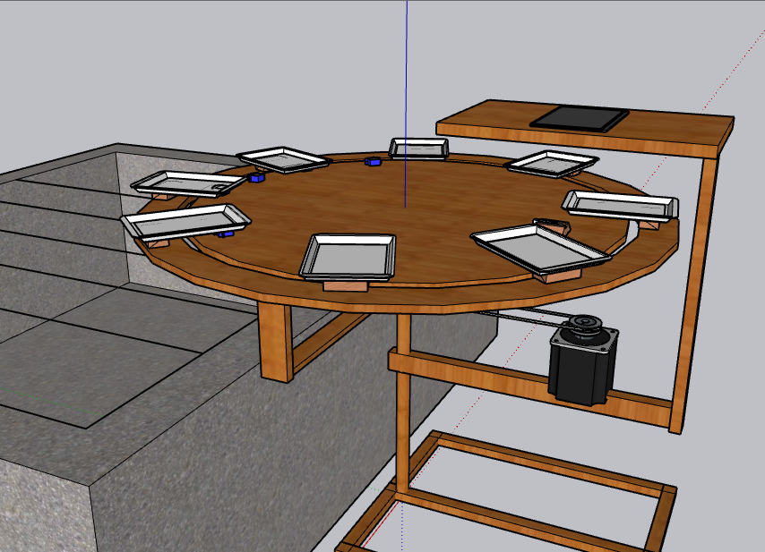

# 🍌 Gradifier

> Philippines' first automated banana sorting and grading management system.

Gradifier is a Progressive Web App (PWA) that integrates with a banana sorting machine to classify, track, and analyze banana batches by grade in real time. Built for farms and quality managers who export to international markets.

---

## 📸 Screenshots

| Landing | Dashboard | Reports |
|---------|-----------|---------|
|  | *(dashboard)* | *(reports)* |

---

## ✨ Features

- **Real-time grading** — live data from the sorting machine via SSE
- **Dashboard analytics** — pie chart + stat cards (total weight, top grade, batch count, last activity)
- **Reports** — weight summary per farm and date, exportable to PDF
- **Operation Logs** — individual batch records with grade badges and confidence scores
- **Filter system** — filter by farm (1–8) and date across all data pages
- **PDF export** — jsPDF-generated reports and logs
- **Profile settings** — update name, email, and profile photo; change password
- **PWA support** — installable, works offline via service worker
- **Responsive UI** — collapsible sidebar on mobile, works on all screen sizes

---

## 🏷️ Banana Grade Classes

| Grade | Description |
|-------|-------------|
| `25BCP` | 25mm Box Cluster Pack |
| `30BCP` | 30mm Box Cluster Pack |
| `33BCP` | 33mm Box Cluster Pack |
| `30TR`  | 30mm Tray |
| `IF36TR`| Individual Finger 36mm Tray |
| `IF38TR`| Individual Finger 38mm Tray |

---

## 🛠️ Tech Stack

| Layer | Technology |
|-------|-----------|
| Backend | PHP 8.1 + MySQLi |
| Database | MySQL 8.0 |
| Frontend | Vanilla JS + jQuery 3.5.1 |
| Charts | Chart.js + chartjs-plugin-datalabels |
| Styling | Tailwind CSS v3 (compiled) + Poppins + Montserrat |
| PDF Export | jsPDF + jsPDF AutoTable |
| PWA | Service Worker + Web App Manifest |
| Auth | PHP Sessions (1-hour inactivity timeout + CSRF) |
| Server | XAMPP (Apache + MySQL) |

---

## 🚀 Getting Started

### Prerequisites

- [XAMPP](https://www.apachefriends.org/) (Apache + MySQL)
- [Node.js](https://nodejs.org/) (for Tailwind CSS compilation)
- PHP 8.1+

### Installation

```bash
# 1. Clone the repository into your XAMPP htdocs folder
git clone https://github.com/your-username/gradifier.git C:/xampp/htdocs/grade

# 2. Install Tailwind CSS
npm install

# 3. Compile CSS (watch mode during development)
npm run build-css
```

### Database Setup

```sql
-- 1. Create the database
CREATE DATABASE grade;
```

```bash
# 2. Import the schema and seed data (in order)
mysql -u root grade < grade.sql
mysql -u root grade < form.sql
```

> DB credentials are in `templates/config.php` — default: `host=localhost`, `user=root`, `password=` (empty), `db=grade`

### Running the App

1. Start **Apache** and **MySQL** in XAMPP Control Panel
2. Open your browser and go to:

```
http://localhost/Grade/templates/index.php
```

---

## 📁 Project Structure

```
grade/
├── templates/          # All PHP pages
│   ├── index.php       # Landing page
│   ├── login.php       # Login form
│   ├── login_backend.php
│   ├── dashboard.php   # Main dashboard
│   ├── reports.php     # Weight reports by farm/date
│   ├── logs.php        # Individual batch logs
│   ├── settings.php    # Profile & password settings
│   ├── header.php      # Shared nav fragment (jQuery loaded)
│   ├── sidebar.html    # Shared sidebar fragment (jQuery loaded)
│   ├── DashBackend.php # JSON API for dashboard chart
│   ├── auth_check.php  # Session guard
│   └── config.php      # DB connection + BASE_URL
├── php/
│   ├── auth.php        # requireLogin() / isLoggedIn()
│   ├── config.php      # Alternate DB config
│   └── pwa_head.php    # PWA <head> include
├── javascript/
│   ├── chart.js        # Dashboard chart + stat cards
│   ├── dropdown.js     # Filter dropdown helpers
│   ├── table.js        # Table utilities
│   └── pagination.js   # Client-side pagination
├── src/
│   ├── input.css       # Tailwind source — edit this
│   └── styles.css      # Compiled output — do not edit
├── icons/              # PWA icons
├── img/                # App images
├── sw.js               # Service Worker
├── manifest.json       # PWA manifest
├── grade.sql           # Database schema
└── form.sql            # Seed / form data
```

---

## 🔐 Authentication

- Session key: `$_SESSION['userid']`
- **1-hour inactivity timeout** enforced via `auth_check.php`
- CSRF token on login form
- Logged-in users are redirected away from `index.php` automatically

---

## 👥 Development Team

| Name | Role |
|------|------|
| Daluro, Hannagene | Developer |
| Palomata, Piolo | Developer |
| Villanueva, Meave | Developer |
| Vitangcor, Alfredo | Developer |

---

## 📄 License

This project was developed as an academic capstone project. All rights reserved.
